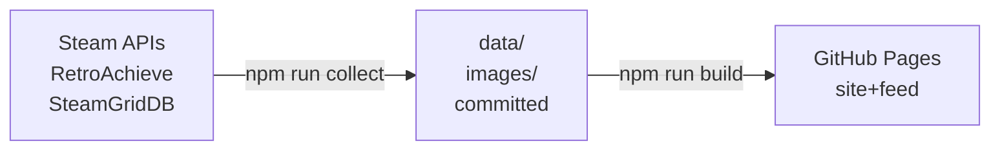

# My Game Feed

<!--
  Badge URLs are repository-specific — GitHub has no relative form for them.
  After using this template, replace `IanSkelskey/game-feed` in the three
  lines below with your own owner/repository.
-->

[](https://github.com/IanSkelskey/game-feed/actions/workflows/ci.yml)
[](https://github.com/IanSkelskey/game-feed/actions/workflows/collect.yml)
[](https://github.com/IanSkelskey/game-feed/actions/workflows/deploy.yml)

A template for publishing your own gaming history. It collects what you have
been playing from **Steam** and **RetroAchievements**, keeps its own copy of the
cover art and achievement badges, and publishes the lot as a browsable site
**and** a static JSON feed any other app can read.

Everything runs on GitHub: a scheduled Action collects, commits, and deploys.
There is no server, no database, and no key to hand out.



## Quick start

1. **Use this template** to make your own repository.
2. **Settings → Pages → Source: GitHub Actions.**
3. **Settings → Secrets and variables → Actions**, and add secrets for whichever
   sources you want. Each source is independent — set only Steam, only
   RetroAchievements, or both.

   | Secret                                                      | Needed for           | Where it comes from                                                                    |
   | ----------------------------------------------------------- | -------------------- | -------------------------------------------------------------------------------------- |
   | `STEAM_API_KEY`                                             | Steam                | [steamcommunity.com/dev/apikey](https://steamcommunity.com/dev/apikey)                 |
   | `STEAM_ID`                                                  | Steam                | Your 64-bit SteamID, or the vanity name from your profile URL — both work              |
   | `RETRO_ACHIEVEMENTS_USERNAME`, `RETRO_ACHIEVEMENTS_API_KEY` | RetroAchievements    | [retroachievements.org/settings](https://retroachievements.org/settings) → Web API Key |
   | `STEAM_GRID_DB_API_KEY`                                     | Cover art (optional) | [SteamGridDB preferences](https://www.steamgriddb.com/profile/preferences/api)         |

4. **Actions → Collect and publish → Run workflow.** After it finishes your site
   is live at `https://<user>.github.io/<repo>/`, with the feed at
   `…/data/games.json`.

A copy made with **Use this template** starts collecting on its own daily
schedule from day one — the template itself is guarded so it never does. See
[why](docs/development.md#why-the-template-never-collects) if you plan to keep
your copy as a template too.

Two gotchas, both Steam's:

- Your profile **and** its "Game details" must both be Public. With a valid key
  but a private profile the API returns success with zero games.
- Without `STEAM_GRID_DB_API_KEY` everything still collects; emulated games just
  have no cover art. Steam games use Steam's own capsule art either way.

## Making it yours

[`site.config.ts`](site.config.ts) at the repo root is the one file you are
expected to edit — the site's name, what gets collected, what gets shown, and
what it is all called:

```ts
export const siteConfig: SiteConfig = {
  site: { name: "My Game Stats", author: { … }, scaffold: { … } },
  collect: { gameLimit: 50, fetchCount: 50, achievementsPerGame: 4, playtime: true },
  display: {
    playtime: true,
    docsPage: true,
    overview: { sections: ["stats", "charts", "completion", "recent"], recentCount: 6 },
  },
  text: {},
};
```

Both halves of the repository import it, so there is no second place for the
collector and the front end to disagree — and the type in
[src/types/index.ts](src/types/index.ts) means a wrong key fails
`npm run typecheck` rather than doing nothing quietly.
[Configuration](docs/configuration.md) covers every option.

## Documentation

| Where                                  | What                                                                        |
| -------------------------------------- | --------------------------------------------------------------------------- |
| [Configuration](docs/configuration.md) | Every `site.config.ts` option, and how to add one                           |
| [The feed](docs/feed.md)               | The published contract, the image library, and the upstream APIs            |
| [Development](docs/development.md)     | Running it locally, the layout, scripts, workflows, conventions             |
| [Security](SECURITY.md)                | Where keys live, and what publishing a feed about yourself actually exposes |
| `/docs` on the running site            | The same feed reference, with real URLs and a live record filled in         |

## License

MIT — see [LICENSE](LICENSE). Game titles, cover art, and achievement badges
belong to their respective publishers; this repository only caches them for
personal display.
